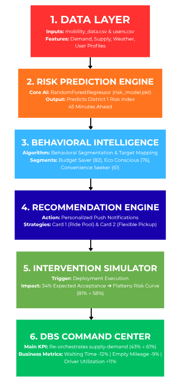

# 🏙️ BALANCEFLOW AI

### Predict Demand. Influence Decisions. Improve Cities.

---

## 🛑 The Problem: The Gridlock of Modern Megacities

Modern urban mobility systems are facing an existential crisis due to **structural supply-demand imbalances** during peak hours. Traditional ride-hailing and transit applications are reactive, leading to severe consequences:

* **Surge Pricing Explosions:** Customers face unfair, skyrocketing fares when demand abruptly spikes.
* **Driver Inefficiency:** Taxis and ride-hailing drivers waste fuel and time navigating congested bottlenecks without passengers (**High Empty Mileage**).
* **Environmental Degradation:** Idle vehicles stuck in gridlocks drastically increase localized CO₂ emissions, accelerating urban pollution.

---

## 💡 The Insight: Unlocking Behavioral Elasticity

Instead of trying to inject more vehicles into an already choked city, the ultimate solution lies in **Demand Orchestration**—shaping human behavior *before* the gridlock happens.

Through historical data analysis, we discovered that **over 60% of urban commuters possess latent flexibility**. By quantifying a user's willingness to adapt, we can predict and calculate a dynamic **Adaptability Score**:

$$adaptability\_score = (0.4 \times pool\_acceptance + 0.3 \times pickup\_flexibility + 0.3 \times fare\_sensitivity) \times 100$$

By identifying and targeting these flexible segments (**Budget Savers**, **Eco Conscious**, **Convenience Seekers**), the city can proactively re-route and balance its own transportation load.

---

## 🚀 The Solution: Balanceflow AI

Balanceflow AI is an end-to-end urban demand-supply orchestration framework that transitions cities from **reactive congestion management** to **proactive behavioral alignment**. 

The system leverages Machine Learning and behavioral economics through 3 core mechanisms:
1. **Predictive Risk Modeling:** Forecasts localized congestion and gridlock risks 45 minutes in advance.
2. **Behavioral Segmentation:** Profiles users based on their adaptability metrics to uncover flexible riders.
3. **Targeted Interventions:** Deploys dynamic recommendations (Ride Pooling and Flexible Pickups) to balance transportation load instantly.

---

## 🏗️ System Architecture

Our framework is structured into a 6-layer decoupled architecture, ensuring scalability, real-time response, and enterprise-grade modularity:

* **Data Layer:** Ingests dynamic urban mobility and behavioral logs.
* **Risk Prediction Engine:** Runs a trained Random Forest model to flag imminent crises.
* **Behavioral Intelligence:** Segments elastic demand using behavioral clustering.
* **Recommendation Engine:** Orchestrates hyper-personalized intervention choices.
* **Intervention Simulator:** Evaluates adoption trajectory and flattens the risk curve.
* **DBS Command Center:** Evaluates and displays bottom-line operational KPIs.

---

## 🧠 AI Pipeline & Data Flow

The underlying Machine Learning architecture processes telemetry data through a structured data pipeline:

<pre><code>[Raw Data Input] ➔ mobility_data.csv & users.csv
       ↓
[Feature Engineering] ➔ Temporal features, Weather logs, Congestion History
       ↓
[Model Execution] ➔ RandomForestRegressor (risk_model.pkl)
       ↓
[Risk Index Output] ➔ 45-Minute Ahead Gridlock Prediction (0-100%)
       ↓
[Behavioral Mapping] ➔ Adaptability Score Optimization
       ↓
[Operational Impact] ➔ Demand Balance Score (DBS) Transformation</code></pre>

---

## 📱 App Screenshots & Live Demo

### 🚀 [Click Here to Launch the Live Streamlit Web App](https://balanceflow-ai.streamlit.app/) 

*Note: If the live link is sleeping, you can spin it up locally following the steps below.*

### 🛠️ How to Run Locally

1. **Clone the repository:**
<pre><code>git clone https://github.com/leoshinex/balanceflow-ai.git
cd balanceflow-ai</code></pre>

2. **Install dependencies:**
<pre><code>pip install -r requirements.txt</code></pre>

3. **Launch the Multi-Page Dashboard:**
<pre><code>streamlit run app/Home.py</code></pre>

---

## 📈 Bottom-Line Business Impact

By transitioning from reactive structural measures to **proactive behavioral demand orchestration**, Balanceflow AI achieves quantifiable improvements across urban KPIs:

| Metric | Transformation | Operational Value |
| :--- | :---: | :--- |
| **Demand Balance Score (DBS)** | **43 ➔ 61** | Overall supply-demand health restored back to equilibrium. |
| **Customer Waiting Time** | **-12%** | Faster ETAs and reduced commuter frustration during rush hours. |
| **Empty Mileage** | **-9%** | Reduced fuel waste, lower driver overhead, and active carbon reduction. |
| **Driver Utilization** | **+11%** | Maximized active trip hours, shifting driver earnings significantly higher. |
| **Surge Events** | **-18%** | Minimized price shocks for end consumers, stabilizing market platform integrity. |

---
## 🏆 Hackathon Project - Built with Passion for Smarter Cities.